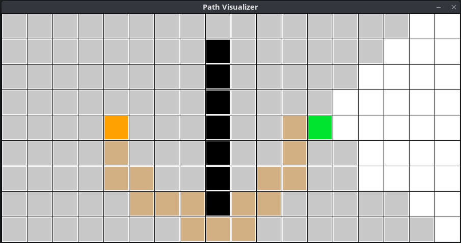

# Uniform-Cost Search Algorithm Visualizer
A simple application that visualizes how a uniform-cost search algorithm works on a grid-like matrix to find the shortest path between two nodes.

In the screenshot below, you can see a finished search result. The black nodes represent obstacles; the orange and green nodes represent start and end points, respectively; gray nodes represent visited nodes by the algorithm; and finally, the light orange nodes represent the shortest path found.

Both, the visited nodes and the found shortest path will be drawn incrementally to show the actual behavior of the algorithm.

If a path cannot be found (because, for example, obstacles make it impossible to reach the goal), the visited nodes will still be drawn to represent what the algorithm processed in the case of search failure.

### How to use
Add/remove obstacles by left-clicking on the grid cells, and add/remove start/end nodes by right-clicking on the grid cells. Run the algorithm by pressing *ENTER* (it is required to place at least start and end nodes in order to run the algorithm), and reset it by pressing *SPACE*.

### Built with
- [Golang bindings for raylib](https://github.com/gen2brain/raylib-go)
